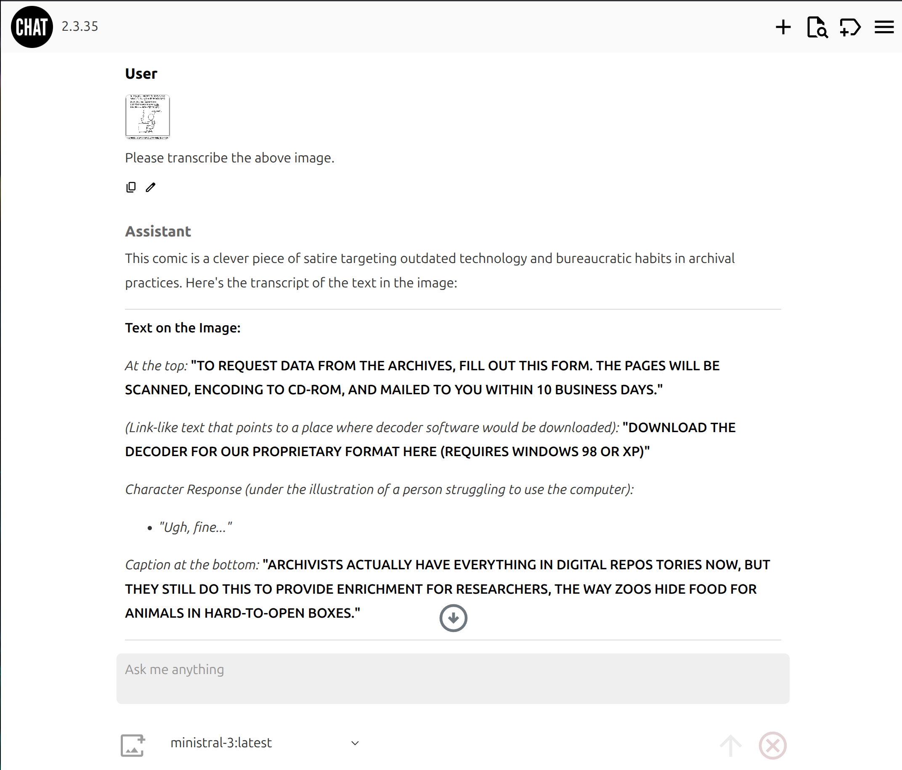

# chat-client

`chat-client` is a small Starlette web app for chatting with OpenAI-compatible LLM backends such as Ollama, OpenAI, Gemini-compatible endpoints, and similar servers.

[](docs/screenshot.png)

## Features

- Server-rendered UI with SQLite storage
- User accounts and chat history
- Prompt management
- Image uploads for vision-capable models
- Attachment uploading for tool usage
- Tool calling through local tools or MCP
- Vision, Thinking and tool usage. 

See [docs/mcp.md](docs/mcp.md) for MCP notes.

## Install

Install the latest version:

<!-- LATEST-VERSION-UV -->
	uv tool install git+https://github.com/diversen/chat-client@v2.3.69

Initialize config and data:

```bash
chat-client
```

This creates `data/config.py` and the database if they do not already exist. It also prompt you to create the first user.

Edit `data/config.py` to configure your providers and models. It defaults to all models running on a local `ollama` server. Then start the app:

```bash
chat-client server-dev
```

Open <http://localhost:1972>.

## Tests

Backend tests:

```bash
python tests/run_all_tests.py
```

E2E tests:

```bash
npm install
npx playwright install
npm run e2e
```

See [tests/README.md](tests/README.md) for test notes.

## Python Tool

The built-in Python tool runs in Docker. Build the image before using it:

```bash
sandbox/build_python_tool.sh
```

You can configure its timeout in `data/config.py` with `PYTHON_TOOL_TIMEOUT_SECONDS`.

## Upgrade

<!-- LATEST-VERSION-UV-FORCE -->
	uv tool install git+https://github.com/diversen/chat-client@v2.3.69 --force

MIT © [Dennis Iversen](https://github.com/diversen)
