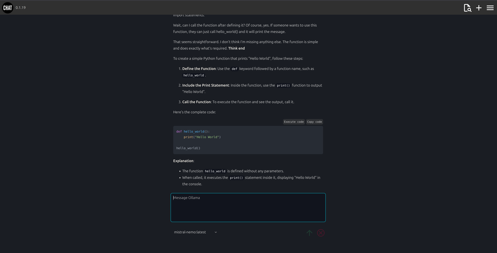

# chat client

Use the simple `chat-client` to chat with a local or remote LLM.

[](docs/screenshot.png)

## Requirements

Access to a chat service that can use the OpenAI API. This can be a local or remote instance of the chat service. 

Example are e.g. `ollama` or `openai` etc. 

## Features

* user authentication and registration
* highlight code
* highlight KaTeX math
* user profile
* dark and light mode
* user dialog history
* user dialog management (delete dialogs)
* copy dialog message to clipboard
* load and continue saved dialogs
* tool support (if enabled)
* python execution (if enabled)
* supports ollama and openai models (and others that models that support the openai api)
* easily enable all chat models (or any other provider that can use the openai api)

## Installation using pipx

Install latest version of chat-client globaly:

<!-- LATEST-VERSION-PIPX -->
	pipx install git+https://github.com/diversen/chat-client@v2.3.0

Make a dir for configuration and data:

```bash
mkdir chat_test
cd chat_test
```

Initialize the configuration and data dir:

```bash
chat-client

# Run initial migrations
chat-client init-system

# create a user
chat-client create-user

# start dev server. This will work if ollama is installed and running
# You should have access to all ollama models
chat-client server-dev
```

All data is stored in `./data/` directory. E.g. `log files` and sqlite3 `database`.
You should checkout the `./data/config.py` file and change the configuration to fit your needs. 

## Upgrade using pipx

Upgrade to latest version

<!-- LATEST-VERSION-PIPX-FORCE -->
	pipx install git+https://github.com/diversen/chat-client@v2.3.0 --force

And then restart the running server instance. 

## Installation using uv and pip

```bash
git clone https://github.com/diversen/chat-client.git
cd chat-client
uv venv
source .venv/bin/activate
uv pip install -r requirements.txt
uv pip install -e .
```


MIT © [Dennis Iversen](https://github.com/diversen)
